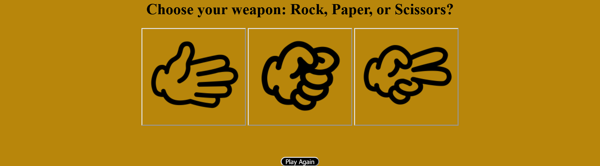

# JavaScript Rock, Paper, Scissors, Game. 

A Rock, Paper, Scissors game created with HTML, CSS, and JavaScript. 

### Play the game [here](https://iceeeberg.github.io/Rock-Paper-Scissors/)

## Summary 

This was the first game application I created with the use of HTML, CSS, and JavaScript. I had a lot of fun making it and look forward to adding more game applications to my repository. The biggest takeaways I took from creating this game was using  the JavaScript function Math.floor as well as gaining more insight on how to style my click events using CSS. 

## Author 

Dante Leeseberg - Full Stack Software Developer [LinkedIn](https://www.linkedin.com/in/dante-leeseberg-bba05883/) | [Website](https://www.danteleeseberg.com/)
